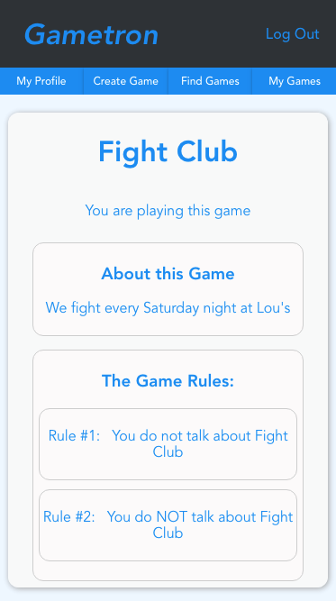

[](https://app.netlify.com/sites/gametron/deploys)


## About
  Gametron is a web application that helps people to gamify their lives. 

## Screenshots

<br />



## Links
- [Client Repo](https://github.com/murdisto/gametron-client)
- [Server Repo](https://github.com/murdisto/gametron-server)
- [Deployed Client](https://gametron.netlify.com/)

## API Overview
```        
├── /auth
│   └── POST
│       ├── /login
│       ├── /refresh
├── /users
│   └── POST /
│   └── GET
│       ├── /:id
├── /games
│   └── GET
│       ├── /
│       ├── /:id
│   └── POST /
│   └── PUT /:id
│       ├── /join/:id
│       ├── /leave/:id
│       ├── /scores/:id
│   └── DELETE /:id
├── /posts
│   └── GET /
│       ├── /:id
│   └── POST /
│   └── PUT /:id
│   └── DELETE /:id
├── /image-upload
│   └── POST /
├── /email
│   └── POST /
│   └── GET /confirm/:id
``` 

## Development Stack
**Front End:**
  - React
  - Redux
  - CSS

**Back End:**
  - Express
  - Passport
  - MongoDB
  - Mongoose

**Testing:** 
  - Mocha
  - Chai
  - Enzyme


